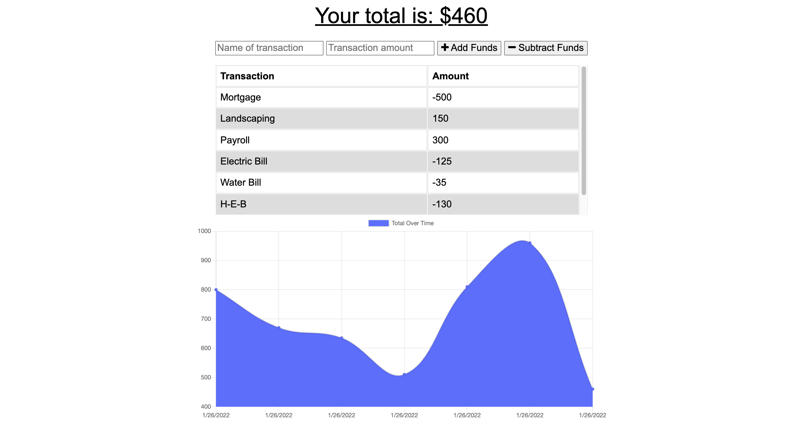

# Budget Tracker 

## Description 📖 
With this app users can keep track of their budget by adding or subtracting funds. This app has ability to store the users data and to function without internet connectivity. 

## Table of Contents 
1. [Installation](#installation)
2. [Usage](#usage)
3. [License](#license)
4. [Links](#links)
5. [Contribution](#contribution)
6. [Visual](#visual)
7. [Questions](#questions)

## Installation
💾
 
There is no installation required for this application, it has been deployed to [Heroku](https://desolate-shore-78738.herokuapp.com/).

## Usage
🧰
 
Enter your starting Budget by initially adding funds, then from there you can add or subtract from your budget as you go about your day to help you keep track of your current budget. 

## License

 
This project is covered by the [MIT](https://choosealicense.com/) license.

## Links
🔗 
* [Heroku](https://desolate-shore-78738.herokuapp.com/)
* [GitHub](https://github.com/MarisolRamirez1031/Budget-Tracker)

## Contribution
🏆 Original code provided by the-[coding-bootcamp](https://github.com/coding-boot-camp/symmetrical-bassoon) and updated by Me, Marisol Ramirez.
 

## Visual

 

## Questions 
❓
[Github](https://github.com/MarisolRamirez1031)
 
Email: marisol_ramirez21@live.com
 
If you have any questions you can reach me via email or my GitHub Account.
